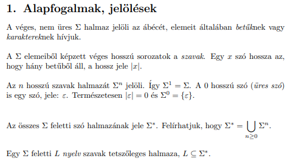
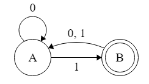
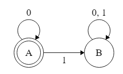
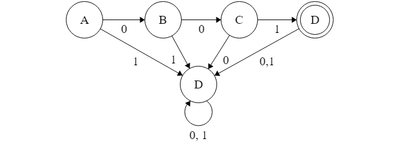
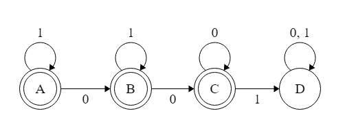
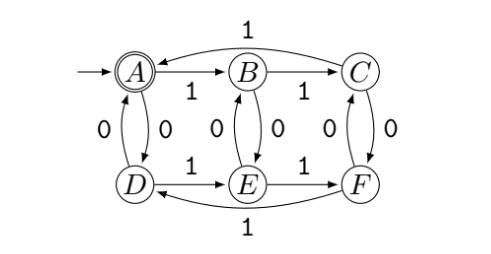
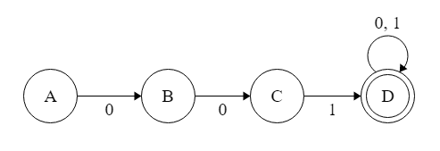
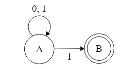

## Table of Contents

- [Linkek](#linkek)
- [Első foglalkozás: Bemelegítés](#első-foglalkozás-bemelegítés)
  - [**Intro**](#intro)
  - [**Állapotgépek**](#állapotgépek)
    - [1. Smiley-k, és ly/lly keresés](#1-smiley-k-és-lylly-keresés)
    - [2. Gyümölcs-árus](#2-gyümölcs-árus)
  - [**Automaták**](#automaták)
    - [**Feladatok**](#feladatok)
- [Második foglalkozás: Teljes véges automaták](#második-foglalkozás-teljes-véges-automaták)
  - [Recap](#recap)
  - [Miért 0/1-eket használunk?](#miért-01-eket-használunk)
  - [**Feladatok**](#feladatok-1)
- [Harmadik foglalkozás: Nyalánkságok](#harmadik-foglalkozás-nyalánkságok)
  - [Recap](#recap-1)
  - ["Az én automatám miért ilyen bonyolult?"](#az-én-automatám-miért-ilyen-bonyolult)
  - [Az a fránya palindrom](#az-a-fránya-palindrom)
  - [**Hiányos automaták**](#hiányos-automaták)
    - [Okosabb ez, mint az eddigiek?](#okosabb-ez-mint-az-eddigiek)
  - [Nemdeterminisztikus automaták](#nemdeterminisztikus-automaták)
    - [Okosabb ez, mint az eddigiek?](#okosabb-ez-mint-az-eddigiek-1)
- [Negyedik foglalkozás: Verseny](#negyedik-foglalkozás-verseny)
- [Ötödik foglalkozás: Reguláris nyelvek](#ötödik-foglalkozás-reguláris-nyelvek)
- [Hatodik foglalkozás: Környezetfüggetlen nyelvek](#hatodik-foglalkozás-környezetfüggetlen-nyelvek)
- [Hetedik foglalkozás: Veremautomata, Turing-gép](#hetedik-foglalkozás-veremautomata-turing-gép)

# Linkek

- https://madebyevan.com/fsm/
- https://infoc.eet.bme.hu/ea12/
- https://classic.csunplugged.org/finite-state-automata/
- http://www.mathmaniacs.org/lessons/fsm/index.html
- http://www.cs.cmu.edu/~tom7/211/fsm1.html
- http://www.cs.bme.hu/~friedl/alg/regularis.pdf
- https://www.geeksforgeeks.org/minimization-of-dfa/
- https://www.cs.bme.hu/~csima/fony00/pumpa/pumpa.html
- https://www.javatpoint.com/automata-conversion-from-nfa-to-dfa
- https://cse.iitkgp.ac.in/~bivasm/notes/scribe/11CS10055.pdf
- https://www.geeksforgeeks.org/state-elimination-method-convert-dfa-nfa-ɛ-nfa-into-regular-expression/
- http://cs.bme.hu/~friedl/alg/cf.pdf
- https://aries.ektf.hu/~serial/kiralyroland/download/formalis_nyelvek_es_automatak_KR_TAMOP_20121116.pdf
- tinyurl.com/algel-gyak
- http://www.cs.bme.hu/~friedl/nyau/jegyzet-13.pdf
- http://revue.sesamath.net/IMG/pdf/mockingbird3.pdf

# Első foglalkozás: Bemelegítés

Az első foglalkozás célja, hogy megismerkedjünk az állapotgépekkel és az automatákkal, illetve, hogy milyen hasznuk van például a szövegfeldolgozásban. A foglalkozás során egy egyszerű automatát fogunk megvalósítani, egy játékos feladaton keresztül. Ha van idő rá, akkor pedig egy kis elméleti háttérrel is megismerkedünk.

## **Intro**

Hogyan olvasnak szöveget a számítógépek? Egyáltalán mi az, hogy szöveg, és mi az az adat? Hogyan jelenít meg egy számítógép egy fájlt, és honnan tudja, hogy mi az? Tényleg olyan egyszerű dolog az a ctrl+f vagy Discordon a smiley-k használata?

## **Állapotgépek**
Egyszerű, mindennapi példák, amiket állapotgépekkel lehet leírni(nem kell mindegyiket részletesen bemutatni, mert az ly/lly végére már unni fogják):

- #### **Lámpa ki/be kapcsolása**
  Rendkívűl egyszerű kétállapotos állapotgép. A lámpa lehet bekapcsolt, vagy kikapcsolt állapotban. A lámpa bekapcsolásával a lámpa bekapcsolt állapotba kerül, a kikapcsolásával pedig a kikapcsolt állapotba.

- #### **Sakk-program**
  A prog3 házimként egy sakk GUI-t kellett csinálnom, ehhez pedig egy állapotgépet használtam arra, hogy mikor mi legyen kattintható a felületen (a játékfelületek működése nem lesz idegen a gyerekeknek). Példa: alapállapotban csak a fehér bábúk mezői kattinthatóak. Utána azok a mezők amire léphet. ha rosszra kattint, visszaugrunk, ha jóra kattint, a fekete bábuk mezői kattinthatóak..

- #### **Italautomata**
     

### 1. [Smiley-k, és ly/lly keresés](https://infoc.eet.bme.hu/ea12/#2)
* Feladat: megkeresni a beírt szövegben a szmájlikat, és utána úgy kiírni a szöveget, hogy képek szerepelnek benne helyettük.
* Feladat: számoljuk meg a beolvasott szövegben az ly betűket, ha lly-t találunk, az 2-nek számít.

### 2. [Gyümölcs-árus](https://classic.csunplugged.org/finite-state-automata/)

Egy interaktív feladaton keresztül a csoport megpróbálja modellezni, hogy a tapasztalataik alapján, hogyan viselkedik egy fura gyümölcs-árus.

* **TODO**: átírni felszerelés-mentesre, és kinyomtatni

* Ez fogja a foglalkozás nagy részének az idejét kitölteni

## **Automaták**

Az előző feladatban már találkoztunk automatákkal, de még nem tudtuk, hogy mi az. Megtanuljuk, hogy hogyan érdemes automatákat rajzolni, hogyan lehet őket leírni, illetve, hogy mik az alapfogalmak, amikkel érdemes tisztában lenni.

Lényegtelen, hogy az állapotokat betűvel(A, B, C, stb.), vagy index-el(q1, q2, q3, stb.) jelöljük, de mutassuk meg mindkét konvenciót, mert feladatmegoldásnál az elsőt akarják majd használni, de a második jól jön bizonyításoknál(Lehet szórakozni a táblázatos, átmeneti-függvényes leírással is, de ezt unalmasnak fogják találni. A későbbi feladatoknál a bizonyításokból ezt ki fogjuk hagyni, és inkább vizuálisan mutatjuk be az algoritmusokat.)

### **Feladatok**

**Ne felejtsd el, hogy jelölni kell a kezdőállapotot!!!** (A [rajzoló program](https://madebyevan.com/fsm/) nem tud ilyet)

* 1-essel végződő szövegek elfogadása

    

* csak 0-kból álló szövegek elfogadása

    

* exact match 001-re

    

# Második foglalkozás: Teljes véges automaták

Ezen a foglalkozáson a cél az ismeretek elmélyítése, szóval megoldunk egy rakat gyakorlófeladatot. Ha gyorsan haladunk, akkor menjünk tovább az elmélettel, és vegyünk elő részeket a következő foglalkozásból, bár ezt a részt szeretni szokták a gyerekek.

## Recap

Vegyük elő az előző órai táblát (hidd el, ott lesz még xd), és menjünk végig rajtuk. Ha valami nem világos, akkor érjük el, hogy rákérdezzenek.

## Miért 0/1-eket használunk?

A számítógépek binárisan tárolják az adatokat, de mi szövegeket akarunk majd kezelni. Ettől függetlenül a feladatmegoldásunkat nagyon megkönnyíti, ha csak kételemű ábécét használunk. Nézzük meg, hogy hogyan tudjuk a 0/1-es szövegeket átalakítani bármilyen szöveggé, illetve fordítva. Bíztassuk a gyerekeket, hogy próbáljanak meg előállni saját kódolással. (**Mizó szerint ez rossz megközelítés**, mert túl szárazak a 0/1-feladatok, helyette rendes [szöveges feladatokat](http://www.cs.cmu.edu/~tom7/211/fsm1.html) kellene megoldani, de szerintem ez nem zavarja a gyerekeket.)

* #### Unárisan

  Ha felsoroljuk az összes lehetséges karaktert, és mindegyiknek adunk egy sorszámot, akkor leírhatunk annyi darab 1-est, amelyik karaktert éppen reprezentálni akarjuk. A karaktereket 0-kal tudjuk szeparálni

* #### Binárisan

  Az ASCII kódoláshoz hasonlóan minden karaktert leírunk binárisan. Meg lehet említeni ennek az előnyeit az unáris kódolással szemben.

## **Feladatok**

* 0/1-es szövegek elfogadása, amikben a 0-k száma páros

    

* #### 0/1-es szövegek elfogadása, amikben a 0-k száma páratlan

  * Ez ugye pont az előző feladat negáltja, szóval csak a kezdőállapotot kell megváltoztatni, de ezt még ne általánosítsuk, ez lesz a következő feladat.

* 0/1-es szövegek elfogadása, amik nem tartalmaznak 001-et ###ezt ne!!

  * lehet az is, hogy "tartalmaz legalább 3db 0-t", akkor cseréljük ki az utolsó 1-et 0-ra.

  

* 0/1-es szövegek elfogadása, amikben a 0-k és az 1-ek száma is páros

  * kérjük meg a gyerekeket arra, hogy próbálják meg rendezni a megoldásaikat, mert borzalom kijavítani őket xdd

  

* Miket fogad el a következő automata?

  

  * Megoldás: olyan szövegeket, amikben van 1,  ́es az utolsó 1 után páros sok 0.

* #### Ha vannak okosak, akik nem bírnak magukkal, akkor próbálják meg a palindromokat, azzal biztosan ellesznek egy darabig  :)

Ha kifogytunk a feladatokból, akkor menjünk tovább az elmélettel, vagy gyártsunk még többet.

# Harmadik foglalkozás: Nyalánkságok

Ezen a foglalkozáson az előző órák gyakorlatával felvértezve, nekiállunk bizonyítgatni, és megismerkedünk a hiányos, illetve a nemdeterminisztikus automatákkal. Tanulunk néhány algoritmikus trükköt, amikkel megmutatjuk, hogy ezek is pontosan ugyanazt tudják, mint a teljes determinisztikus automaták, csak lustábbak lehetünk, amikor megoldjuk a feladatokat.

## Recap

Vegyük elő az előző órai táblát, és menjünk végig rajtuk. Ha valami nem világos, akkor érjük el, hogy rákérdezzenek.

## "Az én automatám miért ilyen bonyolult?"

Egy automatával sok másik ekvivalens automatát tudunk készíteni, amik kisebbek, vagy egyszerűbbek. Beszélhetünk egy kicsit arról is, hogy milyen gondolatmenettel tudunk minimális automatát készíteni (bár ez már az előző foglalkozáson el kéne hangozzon), de most azt is megtanuljuk, hogy hogyan tudunk egy, már meglévőt [minimalizálni](https://www.geeksforgeeks.org/minimization-of-dfa/).

  * Ezt a részt lehet, hogy ki kell hagyni, mert nem biztos, hogy érdekli a gyerekeket, de ha van idő és kedv, akkor érdemes lehet elmondani.

## Az a fránya palindrom

Bizony nem mindent tudnak eldönteni az automaták. Próbáljunk, meg olyan automatát tervezni, ami elfogadja a palindromokat, és csak azokat fogadja el. Elmélkedjünk rajta, hogy vajon miért nem akar ez sikerülni. Ha elég ember megsejti, hogy szar van a palacsintában, akkor bizonyítsuk be a feladat lehetetlenségét.

* Ha kisebb csoportot tanítunk akkor érdemes skatulya elvvel bizonyítani

  

* idősebbeknek meg lehet mutatni a [pumpálós lemmát](https://www.cs.bme.hu/~csima/fony00/pumpa/pumpa.html). Ha ezt választjuk, akkor érdemes lehet továbbai nem reguláris nyelveket is bizonyítani a gyakorlás kedvéért.

## **Hiányos automaták**

Ieformatikusos cuccot tanulunk, az informatikusok majdnem matematikusok, azok pedig lusták. Amúgy is folyton lefelejtjük a nem-releváns átmeneteket, úgyhogy nézzük meg, hogy hogyan lehet ezt legálisan is megtenni. Mutassuk be példaként az exact szöveget felismerő automatát, ezúttal a hiányos verzióban.

Na ez már sokkal barátibb! Mondjuk el nekik a pontos játékszabályokat.

### Okosabb ez, mint az eddigiek?

Az előbb láttuk, hogy van olyan, amit nem tudtunk teljes automatával megcsinálni. Sajnos ezzel sem. De ahhoz, hogy további feladatoknál (nem lesznek további feladatok xd) használhassuk a hiányosat, ahhoz meg kell mutatnunk, hogy pontosan ugyanazt tudja, mint a teljes. 

* Általánosítva csináljunk bármilyen teljes automatából hiányosat! Ez ugye triviális, mert minden teljes egyben hiányos is, egyszerűen elhagyhatunk nem-releváns átmeneteket.

* Általánosítva csináljunk bármilyen hiányosból teljeset! Ehhez nem kell mást tennünk, mint felvenni, egy új nem-elfogadó állapotot amibe az összes hiányzó átmenet megy, és nem lehet belőle az írányított élek mentén elfogadó állapotba jutni.

## Nemdeterminisztikus automaták

Részletesen megtervezni egy automatát olyan bonyolult! Minden lehetséges esetet számításba kell venni. Nem az volt, hogy mi lusták tudunk lenni, ha akarunk? DE. Mutassuk be példaként az 1-re végződő automatát, ezúttal nemdeterminisztikus verzióban.

Mondjuk el a részletes játékszabályokat, levezetési fástúl. Érdemes megjegyezni, hogy a determinisztikus és a hiányos véges automata is speciális esete a nemdeterminisztikusnak.

### Okosabb ez, mint az eddigiek?

Hiányos automatával ugye még nem tudtunk palindromot elfogadtatni. Sajnos ezzel sem tudunk. De ahhoz, hogy további feladatoknál (nem lesznek további feladatok xd) ezt is használhassuk, ahhoz meg kell mutatnunk, hogy pontosan ugyanazt tudja, mint a determinisztikus.

* Általánosítva csináljunk bármilyen determinisztikus automatából nemdeterminisztikusat! Ez ugye triviális, mert minden nemdeterminisztikus egyben determinisztikus is, egyszerűen beírhatunk akár plusz átmeneteket, ha akarunk.

* Általánosítva csináljunk bármilyen nemdeterminisztikus automatából determinisztikusat! Van erre egy nagyon menő kis [algoritmusunk](https://www.javatpoint.com/automata-conversion-from-nfa-to-dfa) 

# Negyedik foglalkozás: Verseny

Bontsuk a csoportot két vagy több csoportra a létszámtól függően. Feladatuk kitalálni egy kellően bonyolult nyelvet és a hozzátartozó automatát. Miután mindenki megvan, mutassák be a csapatok az automatákat, amit "magukon modelleznek"

> Nagyon primitív példák a modellezésre:
> - az emberek a csomópontok és egymásra mutatnak vagy feltartott hüvelykujjal vagy ököllel(0/1)
> - egy tárgyat adnak körbe ami bemutatja, hogy hogy halad végig az adott input
> 
> A lényeg, hogy egyértelmű legyen, hogy "hol" vannak a csomópontok, illetve, hogy egy adott csomópont mit kezdett a bemenettel. Érdemes honorálni és felírni az ezeknél kreatívabb megoldásokat

A játék szabályai:
- maximum n+1 állapot, ahol n a csoporttagok száma(szükség esetén én is részt veszek)
- lehetőleg minimális automata, ne legyenek felesleges állapotok, ha nem muszáj
- mindenkinek részt kell vennie a feladatban, ha a kitalálásban, vagy az implementálásban nem is, de legalább értse, hogy mit csináltak az okosok

# Ötödik foglalkozás: Reguláris nyelvek

# Hatodik foglalkozás: Környezetfüggetlen nyelvek

# Hetedik foglalkozás: Veremautomata, Turing-gép