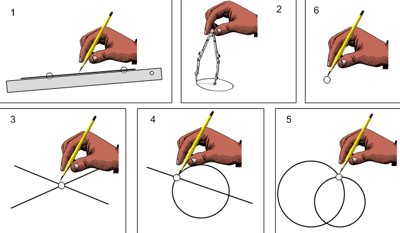
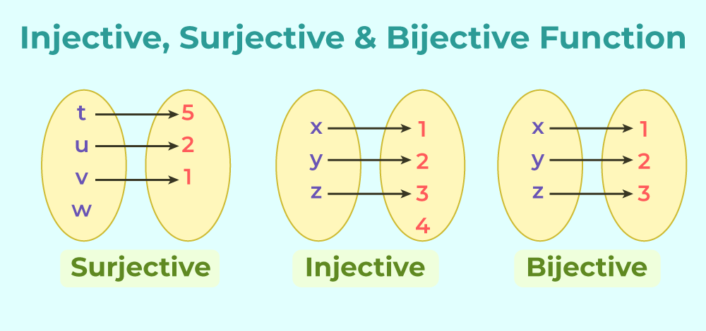
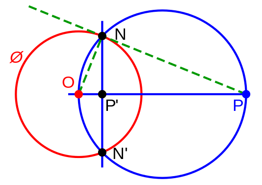
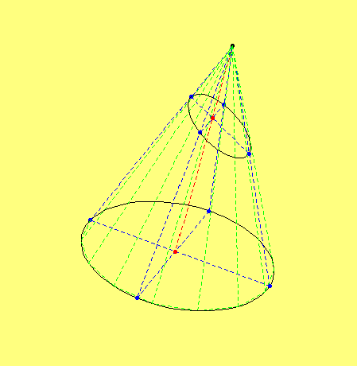

## Table of Contents

- [Mohr-Mascheroni szerkesztések](#mohr-mascheroni-szerkesztések)
    - [Az Euklideszi szerkesztések alaplépései:](#az-euklideszi-szerkesztések-alaplépései)
    - [Körző vagy vonalzó nélkül](#körző-vagy-vonalzó-nélkül)
    - [Geometriai transzformációk](#geometriai-transzformációk)
  - [Inverzió](#inverzió)
    - [Egyenes inverze](#egyenes-inverze)
    - [Kör inverze](#kör-inverze)
  - [Mohr-Mascheroni tétel](#mohr-mascheroni-tétel)
- [Poncelet-Steiner tétel](#poncelet-steiner-tétel)
  - [Eszközváltás](#eszközváltás)
  - [Szomorú tény](#szomorú-tény)
- [Források](#források)

# Mohr-Mascheroni szerkesztések

### Az Euklideszi szerkesztések alaplépései:

Euklideszi szerkesztésnek hívunk mindent, amit gimiben tanultatok szerkesztés néven. A használható lépések:

1. A vonalzót két adott ponton átmenő egyenes megrajzolására használhatjuk.
2. A körzővel adott pont körül adott hosszú sugárral kört rajzolhatunk.
3. Két egyenes metszéspontját megjelölhetjük.
4. Egyenes és kör metszéspontját megjelölhetjük.
5. Két kör metszéspontját megjelölhetjük.
6. ~~Két pont távolságát körzőnyílásba vehetjük.~~ (távolságok lemérésére vonalzót ugye nem használhatunk, tehát van ennek helye, mint alaplépés, de nem feltétlenül fontos, hogy reprodukálni tudjuk)

Amit ezeknek a véges számú ismétlésével meg lehet szerkeszteni az pacek. Ezekből épül fel akár egy merőleges megszerkesztése is, de az önmagában nem alapművelet.
Ugyanakkor nem minden megszerkeszthető (Pl.: szabályos hétszög, szögharmadolás)
> **Kitektintés** 
> Ezeknek a feladatoknak a megszerkeszthetetlenségét algebrailag lehet bizonyítani a [megszerkeszthető számok](https://en.wikipedia.org/wiki/Constructible_number) segítségével. Ezek olyan számok, amik egész számokbóé az összeadás, kivonás, szorzás, osztás, gyökvonás műveletek segítségével előállíthatóak.  
> Ezek a számok pl távolságok vagy arányok, amiket meg lehet szerkeszteni (szintén bizonyítható, hogy ez oda-vissza működik), és a fenti feladatok megoldásához olyan számot kéne előállítani, ami nem esik ebbe a számcsoportba.

Egy bemelegítő szerkesztés: derékszögű háromszög melynek tudjuk két oldalának hosszát. (Nagyobbaknál ugorhatjuk, ha nem gyökerek/fáradtak)
* Vegyük észre, hogy elég nekünk ha csak magukat a pontokat szerkesztjük meg, az oldalak technikailag csak esztétikai célt szolgálnak!
  
### Körző vagy vonalzó nélkül

A hat alaplépés közül néhány triviális az egyik eszköz nélkül is, néhány viszont konkrétan lehetetlennek tűnik.

| Csak körzővel nehéz                                                          |
| ---------------------------------------------------------------------------- |
| 1. A vonalzót két adott ponton átmenő egyenes megrajzolására használhatjuk.* |
| 3. Két egyenes metszéspontját megjelölhetjük.                                |
| 4. Egyenes és kör metszéspontját megjelölhetjük.                             |

 | Csak vonalzóval nehéz                                                    |
 | ------------------------------------------------------------------------ |
 | 2. A körzővel adott pont körül adott hosszú sugárral kört rajzolhatunk.* |
 | 4. Egyenes és kör metszéspontját megjelölhetjük.                         |
 | 5. Két kör metszéspontját megjelölhetjük.                                |
 | ~~6. Két pont távolságát körzőnyílásba vehetjük.~~                       |

\* ezeket szerencsére nem kell majd implementálnunk, hiszen maga az egyenes vagy kör megrajzolása csak esztétikai célt szolgál, ha a többi lépést meg tudjuk oldani más módon

Ahhoz, hogy ekvivalens legyen a csak körző/vonalzós szerkesztés az euklidészivel, ahhoz át kell hidalni a hiányzó lépéseket.  Viszont **csak a pontokat kell tudnunk megszerkeszteni**, maga a kör, vagy az egyenes megjelenése nem feltétlen szükséges.

Először nézzük meg, hogy mi az, ami egyáltalán eszünkbe jut, hogy az egyik eszköz nélkül meg tudjuk szerkeszteni, *egyelőre bármilyen mágia nélkül*. (Itt hagyhatunk egy kis időt, hadd gondolkodjanak. Úgyse fognak tudni csak vonalzósat mondani, hacsak nem tanulták már)

- tükrözés (ha meg van adva a tükör-tengely)
- szabályos háromszög/hatszög
- szakasz duplázás

Folytassuk a dolgokat csak körzővel, az úgyis jobban ment. Ahhoz, hogy pótolni tudjuk a hiányzó lépéseket, ahhoz létre kell hoznunk egy új geometriai transzformációt, a körre tükrözést. Az lesz az elképzelés, hogy *valahogy* körökké alakítjuk, az "egyeneseinket", így tudjuk őket kezelni, és ha megvagyunk, visszaalakíthatjuk őket.

### Geometriai transzformációk

Na de mi az a geometriai transzormáció? Technikailag egy 4D függvény, ami bijektív, tehát van inverze, és lefedi mindkét halmazt. Ugye síkbeli függvényeknél a valós számokhoz rendelünk hozzá másik valós számokat, itt viszont számpárokhoz másik számpárokat, tehát R->R helyett X2->X2. Bijekció az egy specifikus egy-az-egyhez hozzárendelés, az egyértelmű függvény.

> **Kitektintés** 
>Példa egy 3D függvényre a parametrikus görbe. Pl.: [0, 2&pi;] -> R2 : $f(t)=(sin(t), cos(t))$. Ez egy kört rajzol ki, amit síkbeli függvénnyel nem érhetnénk el, ugyanis a kör egyenletét rendezve azt kapjuk, hogy $y = \sqrt{1-x}$ , ami az alsó félkört nem rajzolja ki, ugyanis egyrészt így definiáljuk a gyökfüggvényt, másrészt, ha kirajzolná, akkor nem lenne függvény.

>**Opcionális** 
>Próbáljunk meg hozzárendelést találni az alábbi objektumok között!
> - szakasz és hosszabb szakasz
> - szakasz és körív
> - szakasz és végpontok nélküli szakasz
> - szakasz és egyenes
> - körlap és sík
> - szakasz és sík

Az általunk ismert geometriai transzformációk, általában mind szögtartóak, egyenestartóak és távolságtartóak (kivéve a hasonlóság), szóval nem csoda, ha nem tudjuk emlékezetből sorolni a tulajdonságaikat
- forgatás
- eltolás
- pontra/egyenesre tükrözés
- hasonlóság

## Inverzió 

Nekünk olyan transzformáció kell, ami **nem** egyenestartó! Hogy néz ki egy ilyen?... Egy P pont O középpontú, r sugarú körre vett inverz képét úgy kapjuk meg, hogy $OP \times OP' = r^2$. Most még egyelőre csak higyjük el, hogy ez nem lesz egyenestartó és kezdjünk el inkább azon gondolkodni, hogy hogyan szerkesszük meg.

Ha kicsit átrendezzük a definíció egyenletét, akkor azt kapjuk, hogy $\frac{OP}{r}$ = $\frac{r}{OP'}$ , amit önmagában még valószínűleg nem láttál, mint képlet, de az összetört lelkekben felmerülhet a gyanú, hogy ahol ilyet látok, ott hasonló háromszögekról van szó. Jelöljük be a sugarat, nevezzük el N-nek az új pontot, és meg is vannak a háromszögeink. 
$OP'N\triangle$ ~  $ONP\triangle$ ~ $NP'P\triangle$ , ahol az $ON$ oldal az $r.$ Itt technikailag nincs is szükségünk a harmadik hasonló háromszögre, de nem baj. Szerkesszük meg az inverziót! (Tipp: derékszögű háromszög -> Thalesz-tétel) 
Na de ácsi, mi csak körzővel akarunk szerkeszteni, mi meg itt merőlegest állítotttunk meg mindent! Próbáljuk meg megszerkeszteni ezúttal csak körzővel

>Meggondolandó az az eset, mikor $𝑂𝑃 ≤ 𝑟^2$, hisz ekkor 𝑃-ből 𝑂𝑃 távolsággal kört rajzolva csak egy metszéspontjuk lesz, vagy nem fogják metszeni egymást.
Az ilyen esetek megoldásának kulcsa az, hogy körző segítségével az 𝑂𝑃 távolságot a 𝑃 ponton túl annyiszor kétszerezzük meg, hogy nagyobb legyen, mint $𝑟^2$, s így adódik már
két metszéspont, és a fent leírtakat tudjuk alkalmazni.

Egy kis összefoglalás a triviális észrevételekről: 
- az inverzió kétszer alkalmazva identitás, visszakapjuk az eredeti alakzatokat
- az alapkörön belüli pontokat, az alapkörön kívülre képzi és vica versa
- az alapkör képe önmaga
- az origón átmenő egyenes képe önmaga
- problémás az alapkör középpontjának inverze.
>Ezt vagy ignoráljuk, és elfogadjuk, hogy az inverziót nem definiáljuk erre pontra és egy részleges függvénnyel dolgozunk tovább (mint az $f(x)=\frac{1}{x}$), vagy létrehozzzuk A Végtelenben Lévő Pontot, és ez a két pont egymás inverze lesz. Elképzelésére segítségül hívhatjuk a Riemann-gömböt, és definiálása hasznos lesz a kögyeneseknél. A választás nem befolyásolja a szerkesztéseink lehetségességét.

>**[A Végtelenben Lévő pont](https://en.wikipedia.org/wiki/Point_at_infinity)** 
> A nullával való osztás nincs definiálva, ugyanis lehet $+\infty$ és $-\infty$ is. Jó ez így nem túl precíz, de ahhoz jobban bele kéne menni az analízisbe, és ez most megfelel nekünk. A $P(\infty)$-vel kiegészített számhalmazon ez viszont nem probléma. Egyszerűen felvesszük *valahol* a síkon, és azt mondjuk, hogy létezik és $0$ inverze. A Riemann gömb alapvetően a kiegészített komplex számhalmaz modellje, de mivel a komplex sík megfeleltethető az általunk használt síkkal, ezért egy picit kölcsönvesszük szemléltetésképpen.
> 

>  
>  
> 

> 
> Ezzel pontosan három pont definiál minden kögyenest: a köröket is három, az egyeneseket pedig két pont illetve a VLP.

### Egyenes inverze

Ahhoz, hogy meg tudjuk szerkeszteni egy egyenes inverzét, ahhoz először is tudnunk kell, hogy mit akarunk kapni. Mi lesz egy egyenes inverz képe? Ahogy azt már láttuk, a póluson átmenő egyenes képe önmaga. De én azt ígértem nektek, hogy az inverzió nem lesz egyenestartó, és ez így is van. nézzünk meg egy másik, a póluson át-nem-menő egyenest is. Invertáljuk néhány pontját, és nézzük meg mit kaptunk. Ez bizony egy kör. Bizonyítsuk be, hogy tényleg kört kapunk.

Invertáljunk két pontot: egy tetszőlegesen választott $P$ pontot, illetve $T$-t, ami az $O$-ból állított merőleges talppontja az $e$ egyenesen. Az inverzió tulajdonságaiból adódik, hogy $OP'T'\triangle \sim OTP\triangle$, és mivel $OTP\angle$ derékszög, ezért $OP'T'\angle$ is derékszög bármely szabadon választott $P$ pontra.

A Thálesz tétel kimondja, hogy ha egy $C$ pont a kör ívén van (de nem az átmérőn), akkor az átmérő $C$-ből derékszög alatt látszik. Itt ennek a megfordítását fogjuk felhasználni, tehát ha az átmérő egy $C$ pontból derékszögben látszik, akkor $C$ a köríven van (de nem az átmérőn).

Eddig a következőket tudjuk az egyenesek inverz képéről:
- póluson átmenő egyenes inverze önmaga
- póluson át-nem-menő egyenes képe egy póluson átmenő kör

Tehát, nem igaz az, hogy ez a transzformáció egyenestartó lenne, de az sem, hogy az egyenesből mindig kör lesz. Vagy kör lesz vagy egyenes, fazekasos terminológiával ez egy kögyenes (angolul cline/circline). Bár ezt még nem néztük meg a körök képeire, de az inverzió kögyenestartó.

> Ezen a ponton érdemes lehet bemutatni Geogebra segítségével, ha rendelkezésre áll, hogy hogyan változik át egy egyenes képe körből egyenessé, ahogy egyre közelebb kerül a pólushoz. [A line can be considered as a degenerate circle without a well-defined center and with infinite radius](https://en.wikipedia.org/wiki/Generalised_circle).

Oké, szóval kör lesz. Szerkesszük meg. A két adott pontunk segítségével (amik meghatározzák az egyenest) tengelyesen tükrözzük az inverzió középpontját, ez lesz az általunk keresett kör középpontjának az inverz képe. Miért? A második képen fel van tüntetve a bizonyításnál is használt $T$ talppont. A $C$ pont fele olyan távol van az $O$ ponttól, mint $T'$, hiszen $OT'$ a kör átmérője, tehát az inverzió alkalmazása után a $C'$ pont kétszer olyan távol lesz a középponttól, mint $T''=T$.

 
 

### Kör inverze

Robogjunk tovább a körökre. Kezdjük a legtriviálisabbal: az alapkör képe önmaga. Eggyel kevésbe magától értetődő, de a korábbi állításainkból könnyen belátható, hogy egy póluson átmenő kör képe egy póluson át-nem-menő egyenes lesz, hiszen az inverzió kétszer alkalmazva identitás. Nézzük a póluson át-nem-menő köröket! Ezeknek a képe póluson át-nem-menő kör lesz. 

**insert bizonyítás!!!!!!!!!!!!!!!!!!!!!!!!!!!!!!!!!!!!!!!!!!!!!!!!!!!!!!!!!!!!!!!!!!!!!!!!**.

Mielőtt azonban megszerkesztenénk, tegyünk egy nagyon rövid kitérőt, amit meg fogtok köszönni. Szerkesszük meg egy kör középpontját három adott pontja alapján! Ha ezt meg tudjuk csinálni, akkor nem kell semmiféle spéci szerkesztési technika, egyszerűen csak invertálunk három pontot, és mivel tudjuk, hogy ezek egy körön lesznek, ezért csak meg kell keresnünk a középpontot. Szerencsére ez sem lesz nehéz.

Szépen kiválasztjuk a három megadott pontból találomra az egyiket, tetszőleges sugárral kört rajzolunk, és ez lesz az inverziónk alapköre. Így az eredeti körünk az egy póluson átmenő kör lesz, aminek tudjuk, hogy a képe egyenes. Invertáljuk a maradék két pontunkat, ezzel meg is kaptuk az egyenesünket. Innen az egyenes képét megadó algoritmust követjük, akkor visszakapjunk a körünket, de közben megkaptuk a középpontját is.

Így meg is vagyunk a kör képével. Összefoglalás a körökkel:
- az alapkör képe önmaga
- póluson átmenő kör képe póluson át-nem-menő egyenes
- póluson át-nem-menő kör képe póluson átmenő kör
- (az alapkörre [merőleges kör](https://mathworld.wolfram.com/OrthogonalCircles.html) képe önmaga)

## Mohr-Mascheroni tétel

Most, hogy mindennek meg tudjuk szerkeszteni az inverz képét (és azokat csak körzővel meg tudjuk szerkeszteni), a nehezén túl vagyunk. Ha  meg tudjuk szerkeszteni két egyenes metszéspontját, illetve egy egyenes és egy kör metszéspontját, akkor bebizonyítottuk, hogy mindent, amit meg lehet szerkeszteni körzővel és vonalzóval, azt meg lehet szerkeszteni csak körzővel is.

Na lássuk a medvét! Adott két pontpárunk, amik meghatároznak egy-egy, egymással nem párhuzamos egyenest, szerkesszük meg a metszéspontot. Nem lesz nehéz dolgunk. Invertáljuk az egyeneseinket, és kapni fogunk két kört amelyek két pontban metszik egymást: az origóban($P(\infty)$ miatt), illetve ott, ahol az általunk keresett pont inverze található. Invertáljuk, és meg is vagyunk.

Nem lesz ez nagyon máshogy a kör-egyenes esetben sem. Invertáljuk az alakzatokat, megkapjuk a metszéspont(ok) képe(i)-t, ez(ek)-nek az inverz képe pedig az eredeti metszéspont(ok) lesz(nek). Pontosan annyi metszéspontja lesz a két képkörnek, ahány az eredeti alakzatoknak volt,

Ezzel be is bizonyítottuk a Mohr-Mascheroni tételt, és szabadon otthon hagyhatjuk mostantól a körzőnket. Juhuuu! Az egyetlen probléma, hogy inkább körzőből szokott hiány lenni, mintsem fordítva...

# Poncelet-Steiner tétel

## Eszközváltás

Próbáltunk már a múltkor csak vonalzós szerkesztést találni, de nemigazán találtunk egyet sem (ha de, akkor azt írjuk fel!). Az inverzióval szerencsénk volt, mert csak körzővel meg lehetett szerkeszteni és körökké alakította nekünk a dolgokat. Ilyenünk a vonalzós verzióban sajna nincs. Ettől függetlenül valamit csak meg lehet csinálni, különben nem ülnénk itt.

Szerkesszünk párhuzamost adott ponton keresztül. Nehéz, úgyhogy tegyünk először egy kis kitérőt, ahol visszaköszön egy régi barát: trapéz oiniubwfviubjpweiouvbpwioerubn

**insert proof**

Na ezt fel is tudjuk használni. Csak meg kell *valahogy* szerkeszteni a trapézt, és akkor lesz párhuzamosunk, szerencsére egy trapéznak jó sok egyenese van, illetve megszerncsébbre segítek azzal, hogy feltételezhetjük, hogy egy megfelezett szakasz már rendelkezésre áll az egyenesünkön.

  1. Construct a line $AP$ (in red).
  2. Construct a line $BP$ (in orange).
  3. Define an arbitrary point R on line $AP$.
  4. Construct a line $BR$ (in green).
  5. Construct a line $MR$ (in light blue).
  6. Lines $MR$ and $BP$ intersect at point $X$.
  7. Construct a line $AX$ (in magenta).
  8. Lines $BR$ and $AX$ intersect at point $Q$.
  9. Construct a line $PQ$ (in dark blue), the desired parallel.
   

## Szomorú tény

Ne adjunk fel minden reményt, lehet azért itt dolgokat csinálni. De sajnos nem mindent. Nincs olyan csak vonalzós szerkesztési eljárás, mely bármely kör középpontját előállítaná. Ez pedig azt jelenti, hogy nem fogunk tudni mindent megszerkeszteni, ezért kellett a felezett szakasz is az előző szerkesztésben. Sajnos ezt be is lehet bizonyítani könnyes szemmel:

Indirekt módon bizonyítunk. Metsszünk el egy kúpot két nem párhuzamos síkkal, ahol tegyük fel hogy az egyiken megvalósítottuk vonalzóval a kör középpontjának előállítását. A sztereografikus vetítés egy egyenestartó transzformáció, tehát egy vonalzós szerkesztés lépéseit is levetíti. A kúp csúcsából indított vetítés viszont az egyik kör középpontját nem a másikéba viszi, tehát a vonalzós szerkesztésünk nem a középpontot állította elő.

Egy kis extra segítséggel viszont végre tudjuk hajtani a szükséges lépéseket. A poncelet-Steiner szerkesztés megengedi egy (fix sugarú) körző egyszeri használatát. Elméletben ezzel már sínen leszünk.

# Források
https://artofproblemsolving.com/wiki/index.php/Circular_Inversion
https://maa.org/sites/default/files/pdf/ebooks/pdf/EGMO_chapter8.pdf
http://www.matek.fazekas.hu/images/cikkek/cikkek_20200920_oroszgyula_inverzios_szerkesztes.pdf
https://matkonyv.fazekas.hu/cache/pdf/vol_geometria_iii.pdf
https://web.cs.elte.hu/blobs/diplomamunkak/bsc_mattan/2016/gyalog_eszter.pdf
https://web.cs.elte.hu/blobs/diplomamunkak/bsc_mattan/2010/maczko_renata.pdf